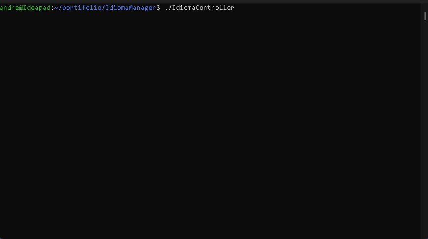

## 🌐 [Português](#versão-em-português) | [English](#english-version) 

## Versão em Português

# 🗣️ IdiomaManager – Sistema de Gerenciamento de Idiomas em C++

Um sistema de **gerenciamento de dados em console**, desenvolvido inteiramente em C++, para armazenar, ordenar e filtrar informações sobre idiomas ao redor do mundo.  
Projeto desenvolvido para a disciplina *Projeto Prático – Sistema de Cadastro em Arquivos com Ordenação (2025s2)* da **Universidade Federal de Lavras (UFLA)**.

---

## 🚀 Funcionalidades

- **Estrutura de vetor dinâmico** com gerenciamento manual de memória  
- **Operações CRUD** (Criar, Ler, Atualizar, Excluir)  
- **Armazenamento persistente** através de arquivo CSV (`db.csv`)  
- **Implementações próprias de QuickSort** para diferentes atributos  
- **Busca binária** por nome, família linguística ou país principal  
- **Exclusão lógica** (registros marcados como deletados, mas mantidos em memória)  
- **Validação de entrada e tratamento de erros**  
- **Interface simples e intuitiva no terminal**

---

## 🧩 Detalhes Técnicos

| Aspecto | Descrição |
|----------|------------|
| **Linguagem** | C++ (sem uso de containers da STL) |
| **Paradigma** | Estruturado / Procedural |
| **Persistência** | Arquivo CSV texto |
| **Algoritmos de Ordenação** | QuickSort (por string, numérico e ID) |
| **Algoritmos de Busca** | Busca Binária (nome, família, país) |
| **Estrutura de Dados** | Vetor dinâmico personalizado (`arrayListIdioma`) |

---

## 📂 Estrutura do Projeto
```
IdiomaManager/
├── IdiomaController.cpp # Arquivo principal (contém toda a lógica e a função main)
├── db.csv # Banco de dados persistente
└── docs/
    └── Projeto-Prático-Descrição-2025s2.docx # Especificação original
    └── Relatório.docx # Relatório e reflexões do projeto
```

### 🧱 Compilação
```
bash
g++ -std=c++17 IdiomaManager.cpp -o idiomaManager
```

## 💻 Execução do Programa
```
bash
./idiomaManager
```

## 🧾 Estrutura do CSV

A primeira linha do arquivo db.csv é reservada para o número de idiomas armazenados na tabela

Após isso, cada linha segue o formato:

```
#id; nome; familiaLinguistica; numFalantes; pricipalPais;
1; Mandarim; Sino-tibetana; 1100.0000; China; 
2; Espanhol; Indo-europeia (românica); 485.0000; Espanha; 
3; Inglês; Indo-europeia (germânica); 380.0000; Estados Unidos; 
4; Hindi; Indo-europeia (indo-ariana); 345.0000; Índia; 
```
Cada linha representa um idioma, com os seguintes campos:

- **id** → Identificador único do idioma  
- **nome** → Nome do idioma  
- **familiaLinguistica** → Família linguística à qual pertence  
- **numFalantes** → Número de falantes (em milhões)  
- **pricipalPais** → País onde o idioma é predominante  

> ⚠️ O arquivo deve manter o mesmo formato para que o sistema consiga carregar e salvar os dados corretamente.

---

## 🧠 Aprendizados Principais

Durante o desenvolvimento do sistema, foram consolidados diversos conceitos de programação em C++:

- Implementação completa de **alocação dinâmica de memória** e controle de ponteiros  
- Desenvolvimento de **algoritmos de ordenação (QuickSort)** e **busca binária** sem uso da STL  
- Criação de um sistema de **persistência de dados** em arquivos texto (CSV)  
- Ênfase em **clareza estrutural**, **modularidade** e **robustez algorítmica**

---

## 🧰 Desenvolvimento

| Autor | Função |
|--------|--------|
| **André Santos Gomes** | Implementação, arquitetura e documentação |
| **Bernardo Abrahão Mantovani** | Co-desenvolvimento, testes e refinamento |

---

## 🗒️ Licença

Projeto desenvolvido para fins acadêmicos no curso de *Ciência da Computação* da **Universidade Federal de Lavras (UFLA)**.  
O código pode ser reutilizado para fins educacionais ou de referência, desde que seja mantida a devida atribuição aos autores.

---

## 🎥 Demonstração

<p align="center">
  
</p>


> “Um sistema em C++ construído do zero — sem STL, sem frameworks — apenas lógica, algoritmos e controle total.”

---

## English Version

# 🗣️ IdiomaManager – Language Management System in C++

A **console-based data management system** fully developed in C++ to store, sort, and filter information about world languages.  
This project was developed for the course *Projeto Prático – Sistema de Cadastro em Arquivos com Ordenação (2025s2)* at the **Federal University of Lavras (UFLA)**.

---

## 🚀 Features

- **Dynamic array structure** with manual memory management  
- **CRUD operations** (Create, Read, Update, Delete)  
- **Persistent storage** through a CSV file (`db.csv`)  
- **Custom QuickSort implementations** for different attributes  
- **Binary search** by name, language family, or main country  
- **Logical deletion** (records marked as deleted but kept in memory)  
- **Input validation and error handling**  
- **Simple and intuitive terminal interface**

---

## 🧩 Technical Details

| Aspect | Description |
|----------|-------------|
| **Language** | C++ (without STL containers) |
| **Paradigm** | Structured / Procedural |
| **Persistence** | Text-based CSV file |
| **Sorting Algorithms** | QuickSort (string, numeric, and ID) |
| **Search Algorithms** | Binary Search (name, family, country) |
| **Data Structure** | Custom dynamic array (`arrayListIdioma`) |

---

## 📂 Project Structure
```
IdiomaManager/
├── IdiomaController.cpp # Main file (contains all logic and the main function)
├── db.csv # Persistent language database
└── docs/
    └── Projeto-Prático-Descrição-2025s2.docx # Original assignment specification
    └── Relatório.docx # Project report and reflections
```
### 🧱 Compilation
```
bash
g++ -std=c++17 IdiomaManager.cpp -o idiomaManager
```

## 💻 Program Execution
```
bash
./idiomaManager
```

## 🧾 CSV Structure

The first line in the `db.csv` file is reserved for the number of languages in the table

Each line after that follows this structure:
```
#id; nome; familiaLinguistica; numFalantes; pricipalPais;
1; Mandarin; Sino-Tibetan; 1100.0000; China;
2; Spanish; Indo-European (Romance); 485.0000; Spain;
3; English; Indo-European (Germanic); 380.0000; United States;
4; Hindi; Indo-European (Indo-Aryan); 345.0000; India;
```
> ⚠️ The file must follow this format exactly for the system to load and save data correctly.

---
## 🧠 Key Learning Outcomes

During development, several C++ programming concepts were reinforced:

- Full implementation of **dynamic memory allocation** and pointer management  
- Development of **sorting (QuickSort)** and **binary search algorithms** from scratch, without STL  
- Creation of a **data persistence system** using text files (CSV)  
- Emphasis on **code clarity**, **modularity**, and **algorithmic robustness**

---

## 🧰 Development

| Author | Role |
|--------|------|
| **André Santos Gomes** | Implementation, architecture, and documentation |
| **Bernardo Abrahão Mantovani** | Co-development, testing, and refinement |

---

## 🗒️ License

This project was developed for academic purposes as part of the *Computer Science* program at the **Federal University of Lavras (UFLA)**.  
The source code may be reused for educational or reference purposes, provided proper attribution is given to the authors.

---

## 🎥 Demo (In portuguese)

<p align="center">
  
</p>


> “A C++ system built entirely from scratch — no STL, no frameworks — just logic, algorithms, and full control.”